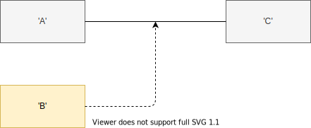
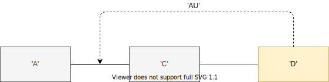

# lexorank

Easily store user-defined order of your ActiveRecord models utilizing lexicographical sorting

Inspired by [Atlassian's Lexorank](https://confluence.atlassian.com/jirakb/understand-the-lexorank-managment-page-in-jira-server-779159218.html).

## Installation

Add this line to your application's Gemfile:

```ruby
gem 'lexorank'
```

And then execute:

    $ bundle install

Your model will need a database column storing the rank. The default ranking column is called `rank`, however you are free to change that (see [rank!](#rank)).

One way to add this in a rails application is to generate a simple migration:

    $ rails g migration AddRankTo<insert model name here> rank:text:uniq

<details>
<summary>This should generate a migration like that:</summary>

```ruby
class AddRankToPages < ActiveRecord::Migration[6.1]
  def change
    add_column :pages, :rank, :text
    add_index :pages, :rank, unique: true
  end
end
```
</details>

## Basic Usage

In your model require `lexorank/rankable`. Afterwards, you will be able to use the `rank!` method like this:

```ruby
require 'lexorank/rankable'
class Post < ActiveRecord::Base
  rank!
end
```

Now you have access to the following methods:

```ruby
# Return all pages in the supplied order
Page.ranked

page = Page.first

# Moves this page instance to the second position
page.move_to(1)

# Alias to page.move_to(0)
page.move_to_top
```

Keep in mind that a newly created record will not have a rank by default. Just manually move it to the position you want it to be.
Alternatively you can setup a `before_create` [callback](https://guides.rubyonrails.org/active_record_callbacks.html) like this:

<details>
<summary>Expand</summary>

```ruby
require 'lexorank/rankable'
class Page < ActiveRecord::Base
  rank!

  before_create do
    self.move_to_top
  end
end
```
</details>

## Class methods


<details>
<summary><a id="rank"></a><code>rank!(field: :rank, group_by: nil)</code></summary>

This is the entry point to use lexorank in your model.

Options:
* `field`: Allows you to pass a custom field which is being used to store the models rank. (defaults to `:rank`)
* `group_by`: Makes it possible to split model ordering into groups by a specific column. [Learn more](#associations-and-grouping)

</details>
<details>
<summary><code>ranked(direction: :asc)</code></summary>

This is a model [scope](https://guides.rubyonrails.org/active_record_querying.html#scopes) which will return the ordered collection.
This will only be available if your model calls `rank!` before. The scope will exclude all models that have no rank set.

Options:
* `direction`: Allows you to pass the orders direction. See `ActiveRecord::QueryMethods::VALID_DIRECTIONS` for possible values. (defaults to `:asc`)
</details>

## Instance methods

Those will only be available if your model calls `rank!` before.


<details>
<summary><a id="move_to"></a><code>move_to(position)</code></summary>

This method will set your object's rank column according to the new position. Position counts start at zero.
This will not persist the rank to the database.
</details>
<details>
<summary><code>move_to_top</code></summary>

Alias to [`move_to(0)`](#move_to)
</details>

<br />

<details>
<summary><a id="move_to!"></a><code>move_to!(position)</code></summary>

Like [`move_to`](#move_to). However, this methods persists the rank to the database directly.
If an update is needed, the method will return the result of `save`, otherwise `true`.
</details>
<details>
<summary><code>move_to_top!</code></summary>

Alias to [`move_to!(0)`](#move_to!)
</details>

<br />

<details>
<summary><code>no_rank?</code></summary>

Returns true if the ranking field is `nil`. This means that the model has no rank yet.
</details>

## Associations and Grouping

Often times you come in a situation where you don't want to order all items in one collection. Lexorank will take care of this by grouping your models by a specified column. This is especially interesting when your model is associated with another one.

Consider the following example:

```ruby
# page.rb
class Page < ActiveRecord::Base
  has_many :paragraphs
end

# paragraph.rb
class Paragraph < ActiveRecord::Base
  belongs_to :page
end
```

When adding lexorank to your paragraph model, ordering would not be page dependent. Instead the whole collection will be considered when moving or retrieving the models via lexorank.

The solution is the `group_by` option of the [`rank!`](#rank) method, which will allow a column or an association name.
Change your paragraph model like this:

```ruby
require 'lexorank/rankable'
class Paragraph < ActiveRecord::Base
  belongs_to :page
  rank!(group_by: :page)
end
```

When moving a paragraph via the [instance methods](#instance-methods) only paragraphs of the model's page will be considered.
Please keep in mind that lexorank can only find the association when you put `rank!` after the association definition.

Alternatively, you can supply the column directly:

```ruby
require 'lexorank/rankable'
class Paragraph < ActiveRecord::Base
  rank!(group_by: :page_id)
  belongs_to :page
end
```

This means that grouping is completely independent of associations and can also be used without them.

Retrieving data in a grouped manner is as simple as utilizing built-in ActiveRecord behavior of scopes:

```ruby
# This will return all paragraphs of the first page in the supplied order.
Page.first.paragraphs.ranked
```

## Internals - How does lexorank work?

The gem works quite simple. When calling `move_to` the gem will identify the item which is on the wanted position and the one before.
Afterwards, a simple function searches for a rank which is between the ranks of the two items.

For example: We want to move a currently unranked item to position 1 which means it should be the second element when calling `ranked` (because positions start at 0).
The gem will look for the element on position 0 and on position 1. When we position our item between those two we'll achieve the wanted position.
Let's say the items have the ranks 'A' and 'C'. The gem will give our item the position 'B' as it is between the other two.



Let's say we want to find a rank between 'A' and 'B'. There is no character in between, which means the gem chooses the new rank value 'AU'. It chooses 'U' because it's the middle between 'z' (highest possible character) and '0' (lowest possible character).



This also means, that given a huge amount of items and frequent moves to similar positions can result to long rank values which will make ordering slower (see [Performance](#performance)).
The solution to this problem is rebalancing all rank values, which currently isn't implemented in this gem.

## Performance

**Disclaimer:** *I'm kinda new to benchmarking. Feel free to give tips or advice on the current [implementations](benchmarks).*

All tests were run with the following setup: ActiveRecord with SQLite on WSL2 running ruby 3.0.0

Because of possible unbalanced ranks, receiving data from the database can slow down. To demonstrate this there is a [benchmark](benchmarks/scope_benchmark.rb) which will compare receiving data from a balanced set of x items against an unbalanced set of x items.

<details>
<summary>Results with 100,000 items</summary>

```
Rehearsal ----------------------------------------------------
Unbalanced:        1.009327   0.190001   1.199328 (  1.199330)
Balanced:          0.605503   0.039992   0.645495 (  0.645499)
------------------------------------------- total: 1.845495sec

                       user     system      total        real
Unbalanced:        0.872151   0.019991   0.892142 (  0.892137)
Balanced:          0.617773   0.000000   0.617773 (  0.617767)
```
</details>
<br />

Another [benchmark](benchmarks/move_to_benchmark.rb) checks how the internal algorithm which calculates new ranks performs. This method is still subject to optimization but one can see here that finding a rank between two close ranks takes significantly more time than finding a rank between two more different ranks.

<details>
<summary>Results (rank length of 100,000 letters):</summary>

```
Rehearsal ----------------------------------------------------------------------------
value between two close ranks:             0.872685   0.100091   0.972776 (  0.992852)
value between two more different ranks:    0.000059   0.000006   0.000065 (  0.000064)
------------------------------------------------------------------- total: 0.972841sec

                                               user     system      total        real
value between two close ranks:             0.818498   0.100112   0.918610 (  0.928660)
value between two more different ranks:    0.000042   0.000000   0.000042 (  0.000035)
```
</details>


## Planned Features

- [ ] task to rebalance ranks
- [ ] method to output information about current balancing situation (number of ranked items, longest rank value, ...)
- [ ] ...

## Development

<details>
<summary>Contributing</summary>

Bug reports and pull requests are highly welcomed and appreciated. This project is intended to be a safe, welcoming space for collaboration, and contributors are expected to adhere to the [code of conduct](CODE_OF_CONDUCT.md).

1. Fork the repository
2. Create your feature branch by branching off of **main** (`git checkout -b my-new-feature`)
3. Make your changes
4. Make sure all tests run successfully (`bundle exec rake test`)
5. Commit your changes (`git commit -am 'Add some feature'`)
6. Push to the branch (`git push origin my-new-feature`)
7. Create a new pull request

</details>

<details>
<summary>During development</summary>

* Install dependencies using `bundle install`
* Run all tests using `bundle exec rake test`
* Run a specifc test using `m path_to_file:line`
</details>

<details>
<summary>Release a new version</summary>

1. Update gem version in ``Lexorank::Version``
2. Add changelog entries
3. Push changes to github
4. Create a release on github and create a tag for the version (v0.1.0 for example).
4. Build gem and push to rubygems.org
</details>

## Changelog

<details>
<summary>0.1.2</summary>

* fix gem specification
* update changelog format
</details>

<details>
<summary>0.1.1</summary>

* update license year
* let rubygems be happy to have an updated version
</details>


<details>
<summary>0.1.0</summary>

*Initial Release*
</details>

## License

Copyright (c) 2021 Richard Böhme (richard.boehme1999@gmail.com)

Lexorank is released under the [MIT License](https://opensource.org/licenses/MIT).
